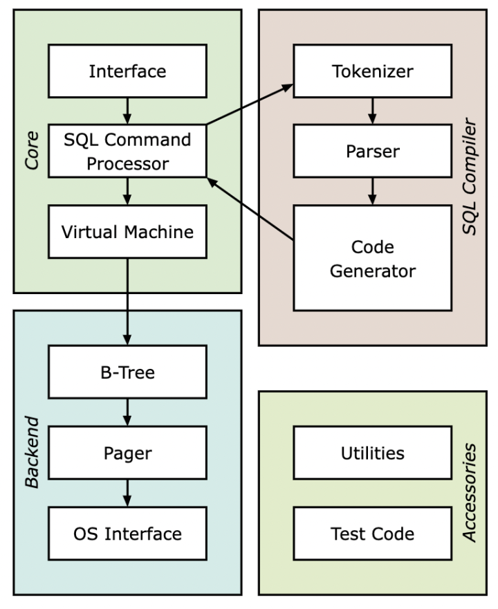

参考 [KCNyu/db_tutorial_cpp: Writing a sqlite clone from scratch in C++ (github.com)](https://github.com/KCNyu/db_tutorial_cpp)

感谢 知乎用户 氰化钾不爱打代码 的教程

## 如何用C++实现一个简易数据库（零）

> **_基于cstack/db\_tutorial C语言版本_**

-   KCNyu
-   2022/2/2

作为笔者写的第一个系列型教程，还是选择基于前人的教程经验以及添加一些自己个人的探索。也许有很多纰漏之处，希望大家指正。

[《如何用C++实现一个简易数据库》](https://www.zhihu.com/column/c_1472652536327389184)

## 0\. 本教程面向对象

学习过基本 C/C++ 编程的同学。

笔者竭尽用**最通俗易懂**的语言手把手教大家如何**从零实现**一个数据库。

## 1\. 数据库是什么？

数据库是“按照数据结构来组织、存储和管理数据的仓库”。是一个长期存储在计算机内的、有组织的、可共享的、统一管理的大量数据的集合。使用者可以对其中的资料执行新增、选取、更新、刪除等操作。

## 2\. SQL是什么？

SQL _**(Structured Query Language:结构化查询语言)**_ 是一种特定目的程式语言，用于管理关系数据库管理系统 _**(Relational database management system，RDBMS)**_，或在关系流数据管理系统 _**(Relationship Flow Data Management System，RDSMS)**_ 中进行流处理。

## 3\. 我们最终会实现什么？

sqlite architecture (https://www.sqlite.org/arch.html)

前端 _**(front-end)**_

-   分词器 _**(tokenizer)**_
-   解析器 _**(parser)**_
-   代码生成器 _**(code generator)**_

后端 _**(back-end)**_

-   虚拟机 _**(virtual machine)**_
-   B树 _**(B-tree)**_
-   分页 _**(pager)**_
-   操作系统层接口 _**(os interface)**_

## 4\. 我们的开发流程是什么？

### 测试驱动开发 _**(test driven development, TDD)**_

-   添加测试用例
-   运行并查看失败的用例
-   改动代码以通过测试
-   通过全部测试

## 5\. 我们的单元目录结构是什么？

### **tutorial**

-   本单元完整代码实现 _**(db.cpp)**_
-   本单元对应测试用例 _**(db\_test.rb)**_
-   本单元对应教程详解 _**(README.md)**_

## 6\. 大纲

