# tutorial01-实现REPL

## 1\. 如何安装我们的单元测试环境？

-   检查我们是否有安装`ruby`。  
    输入命令`ruby -v`，我们将得到

```
ruby 2.7.0p0 (2019-12-25 revision 647ee6f091) [x86_64-linux-gnu] 
```

如果没有安装使用`sudo apt install ruby`或对应操作系统的包管理工具安装即可。

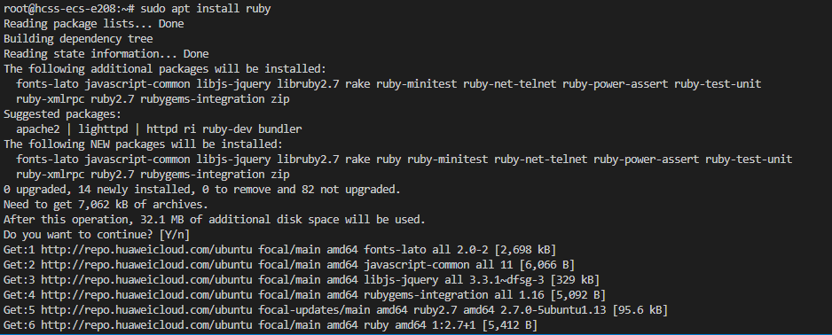

-   检查我们是否有安装`rspec`  
    输入命令`rspec -v`，我们将得到

```
RSpec 3.10
  - rspec-core 3.10.2
  - rspec-expectations 3.10.2
  - rspec-mocks 3.10.3
  - rspec-support 3.10.3 
```

同理如果没有安装则使用`sudo gem install rspec`安装即可。若提示没有`gem`则使用`sudo apt install gem`便可完成安装。

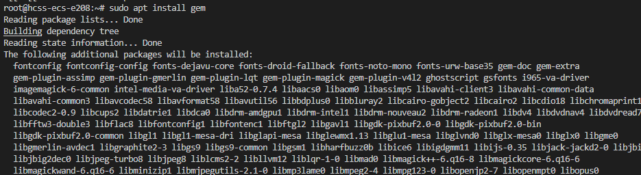

==发现问题==

安装rspec，终端没反应


使用系统提示方法安装（**==此部分错误，见解决gem安装慢或卡住==**）

apt install ruby-rspec-core

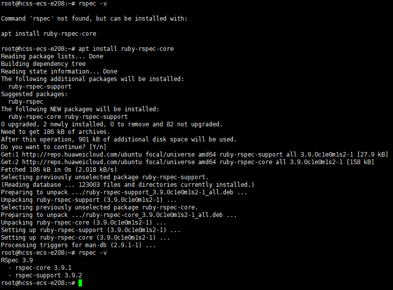

`ruby`和`rspec`版本基本未对本单元测试造成影响，如果存在问题，可提出。

#### 补充:Centos7下安装ruby,rspec

在CentOS 7上安装`gem`，需要先安装Ruby，因为`gem`是Ruby的包管理工具。

使用`yum`包管理器直接安装Ruby，它会自动包含`gem`工具。

```
sudo yum update -y
sudo yum install -y ruby 
gem install rspec
```

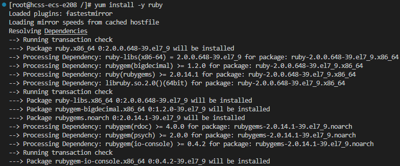

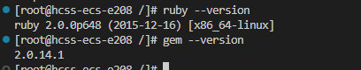

```
#替换源
gem sources --add https://gems.ruby-china.com/ --remove https://rubygems.org/
gem install rspec
```

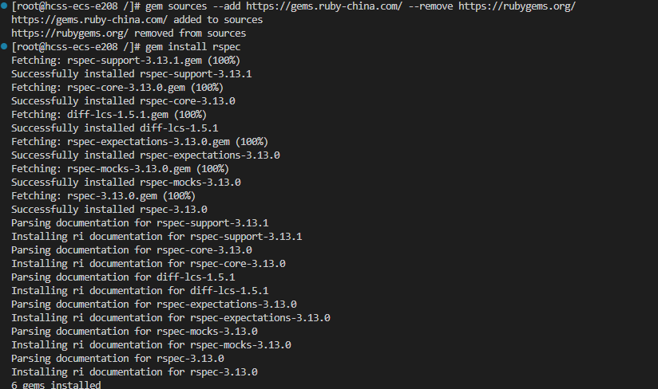

至此我们的测试环境便已经安装完成了。


### 1.1 ruby和rspec介绍

### Ruby

**Ruby** 是一种动态的、开源的编程语言，注重简单性和生产力。它由日本的松本行弘（Yukihiro "Matz" Matsumoto）创建，并于1995年发布。Ruby的语法优雅且易读，使编写代码变得更加愉快和高效。

#### 主要特点：

1. **面向对象**：在Ruby中，一切皆对象，包括基本数据类型。
2. **动态类型和鸭子类型**：Ruby是动态类型语言，不需要声明变量类型。鸭子类型意味着对象的适用性由是否具有特定方法和属性决定，而不是对象的类型。
3. **表达性语法**：Ruby的语法设计简洁明了，易于阅读和编写，提升了编程的愉悦感和生产力。
4. **元编程**：Ruby支持元编程，允许程序将其他程序作为其数据进行处理。
5. **丰富的标准库**：Ruby附带了一个涵盖广泛任务的标准库，从处理文本文件到构建Web服务器。

#### 常见应用场景：

- **Web开发**：如Ruby on Rails，这是一个流行的Web应用框架。
- **自动化脚本**：用于编写脚本和自动化任务。
- **数据处理**：用于数据处理和分析。

关于更多详细信息，可以访问官方Ruby网站。

### RSpec

**RSpec** 是Ruby编程语言的测试工具。它是一个行为驱动开发（BDD）框架，专注于应用程序的行为。RSpec由Steven Baker创建，现在由RSpec核心团队维护。

#### 主要特点：

1. **描述性语法**：RSpec使用自然语言语法，使测试易于阅读和理解。

2. 模块化

   ：RSpec由多个库组成，每个库有特定的用途：

   - `rspec-core`：提供编写可执行示例的结构。
   - `rspec-expectations`：提供表达预期结果的API。
   - `rspec-mocks`：提供测试替身功能，如模拟和存根。
   - `rspec-rails`：将RSpec与Ruby on Rails集成。

3. **匹配器**：RSpec提供灵活的机制将预期结果与实际结果进行匹配。

4. **钩子**：RSpec支持在测试前后运行代码的设置和拆卸钩子。

5. **专注于BDD**：RSpec鼓励开发者专注于应用程序的期望行为，而不是实现细节。

#### RSpec语法示例：

```
require 'rspec'

RSpec.describe '一个示例组' do
  it '有一个示例' do
    expect(1 + 1).to eq(2)
  end
end
```

#### 使用场景：

- **单元测试**：测试代码的单个单元，以确保其正常工作。
- **集成测试**：测试应用程序的不同部分如何协同工作。
- **行为驱动开发**：通过测试定义应用程序的期望行为，然后开发满足这些测试的代码。

关于更多详细信息，可以访问[官方RSpec网站](https://rspec.info/)。

## 2\. 如何编写和使用我们的第一个单元测试？

让我们在目录下创建`db_test.rb`文件。

```ruby
describe 'database' do
  def run_script(commands)
    raw_output = nil
    IO.popen("./db", "r+") do |pipe|
      commands.each do |command|
        pipe.puts command
      end

      pipe.close_write

      # Read entire output
      raw_output = pipe.gets(nil)
    end
    raw_output.split("\n")
  end

  it 'test exit and unrecognized command' do
    result = run_script([
      "hello world",
      "HELLO WORLD",
      ".exit",
    ])
    expect(result).to match_array([
      "db > Unrecognized command: hello world",
      "db > Unrecognized command: HELLO WORLD",
      "db > Bye!",
    ])
  end
end
```

让我们来执行它看看，输入`rspec spec db_test.rb`

```
LoadError:
  cannot load such file ... 
```

显然是会失败的，因为我们甚至还没有在目录下编译创建我们的`db`文件。 现在让我们从最简单交互窗口`REPL`开始。

### 补充 解释rb文件

代码是一个使用 RSpec 框架编写的测试脚本，用于测试一个名为 `db` 的数据库程序。以下是对这段代码的详细解释：

**整体结构**

```
describe 'database' do
  ...
end

```

- `describe 'database' do ... end` 是一个 RSpec 代码块，用于定义一个测试组（描述块），描述与数据库相关的测试。

### `run_script` 方法

```
def run_script(commands)
  raw_output = nil
  IO.popen("./db", "r+") do |pipe|
    commands.each do |command|
      pipe.puts command
    end

    pipe.close_write

    # Read entire output
    raw_output = pipe.gets(nil)
  end
  raw_output.split("\n")
end

```

- `run_script` 方法定义了一个辅助函数，用于运行一系列命令并捕获程序的输出。
- `IO.popen("./db", "r+")` 启动一个子进程，运行 `./db` 程序，允许读写操作。
- `commands.each do |command| pipe.puts command end` 将每个命令写入管道，发送到 `./db` 程序。
- `pipe.close_write` 关闭写入端，表示所有命令已经发送完毕。
- `raw_output = pipe.gets(nil)` 读取程序的所有输出，并存储在 `raw_output` 变量中。
- `raw_output.split("\n")` 将输出按行分割成数组，并返回该数组。

### `it 'test exit and unrecognized command' do ... end`

```C++
it 'test exit and unrecognized command' do
  result = run_script([
    "hello world",
    "HELLO WORLD",
    ".exit",
  ])
  expect(result).to match_array([
    "db > Unrecognized command: hello world",
    "db > Unrecognized command: HELLO WORLD",
    "db > Bye!",
  ])
end

```

- `it 'test exit and unrecognized command' do ... end` 定义了一个测试用例，描述了它要测试的行为（退出和未识别的命令）。

- `result = run_script([ ... ])` 调用 `run_script` 方法，传入一系列命令，并将结果存储在 `result` 变量中。

- ```
  expect(result).to match_array([ ... ])
  ```

   使用 RSpec 的 

  ```
  expect
  ```

   方法来定义预期结果。

  - `result` 应该匹配一个数组，数组中的每个元素对应程序的输出。
  - 数组包含以下预期输出：
    - `"db > Unrecognized command: hello world"`：未识别的命令 `hello world` 的输出。
    - `"db > Unrecognized command: HELLO WORLD"`：未识别的命令 `HELLO WORLD` 的输出。
    - `"db > Bye!"`：退出命令 `.exit` 的输出。

### 总结

这段 RSpec 代码测试了 `db` 程序的两个功能：

1. 当输入未识别的命令时，程序应输出相应的错误消息。
2. 当输入 `.exit` 命令时，程序应正确退出并输出告别消息。

通过 `run_script` 方法，测试用例能够模拟用户输入命令并捕获程序的输出，从而验证程序的行为是否符合预期。


## 3\. REPL是什么？

“读取-求值-输出”循环 _**(英語：Read-Eval-Print Loop，简称REPL)**_，也被称做交互式顶层构件 _**(英語：interactive toplevel)**_，是一个简单的，交互式的编程环境。

## 4\. 怎么实现一个简单REPL？

首先我们直接启动一个无限循环，就像一个shell一样。之后我们`print_prompt()`意味着打印提示符。接着虽然std::string被大家诟病许久，但是作为我们简易数据库的使用也暂且足矣。我们每次重复创建`input_line`这个string对象，同时通过`std::getline`这个函数从`std::cin`标准输入中获取到所需信息（以换行符做分割，即回车标志着新语句）

`.exit`意味着退出当前REPL交互，即成功退出，其他情况即输出未知命令。

```C++
void DB::print_prompt()
{
    std::cout << "db > ";
}

bool DB::parse_meta_command(std::string command)
{
    if (command == ".exit")
    {
        std::cout << "Bye!" << std::endl;
        exit(EXIT_SUCCESS);
    }
    else
    {
        std::cout << "Unrecognized command: " << command << std::endl;
        return true;
    }
    return false;
}
void DB::start()
{
    while (true)
    {
        print_prompt();
        
        std::string input_line;
        std::getline(std::cin, input_line);

        if (parse_meta_command(input_line))
        {
            continue;
        }
    }
}
```

### 测试

让我们来测试一下，首先编译我们的文件`g++ db.cpp -o db`，再输入`rspec spec db_test.rb`


```ruby
.

Finished in 0.00504 seconds (files took 0.07621 seconds to load)
1 example, 0 failures
```

结果显然，恭喜大家通过了所创建的单元测试。

#### 实际操作

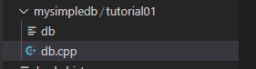

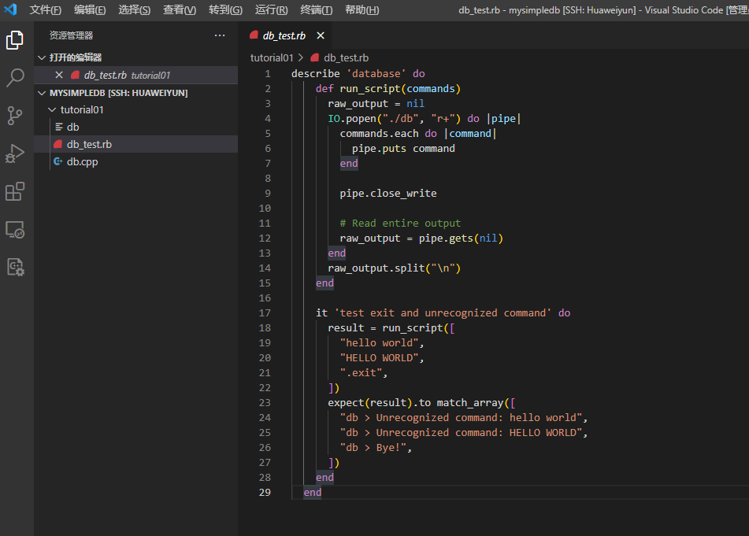

报错

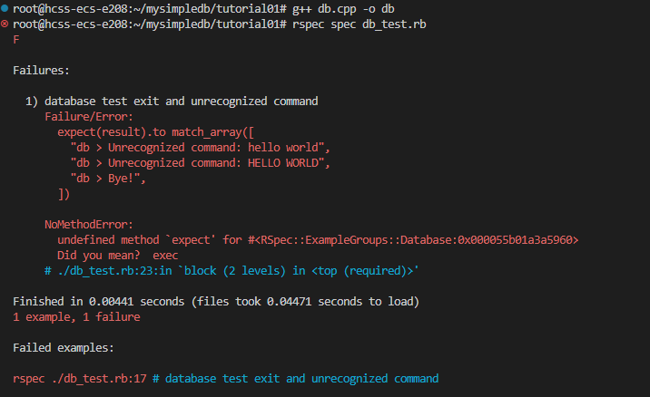

repec没安装好，重新安装，见 解决gem安装慢 

测试成功

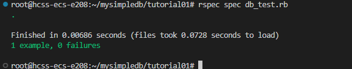

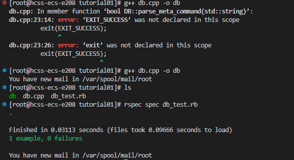

## 3\. 总结

作为教程第一章，实现REPL是非常基础的。由于我们使用了`std::string`，故省去了很多`c_str`内存管理以及长度等一系列繁琐的事情。同时基于我们的测试进行开发，作为教程来说可以让大家更加清楚该朝着哪个方向前进。下一章我们将对输入的命令进行更进一步的分析。

## 4.完整代码

db.cpp

```C++
#include <iostream>
#include <string>
#include <cstdlib> #EXIT_SUCCESS在这个库

class DB
{
public:
    void start();
    void print_prompt();

    bool parse_meta_command(std::string command);
};

void DB::print_prompt()
{
    std::cout << "db > ";
}

bool DB::parse_meta_command(std::string command)
{
    if (command == ".exit")
    {
        std::cout << "Bye!" << std::endl;
        exit(EXIT_SUCCESS);
    }
    else
    {
        std::cout << "Unrecognized command: " << command << std::endl;
        return true;
    }
    return false;
}
void DB::start()
{
    while (true)
    {
        print_prompt();
        
        std::string input_line;
        std::getline(std::cin, input_line);

        if (parse_meta_command(input_line))
        {
            continue;
        }
    }
}

int main(int argc, char const *argv[])
{
    DB db;
    db.start();
    return 0;
}
```


补充：ubuntu下安装C++环境部分命令

```bash
sudo apt update
```

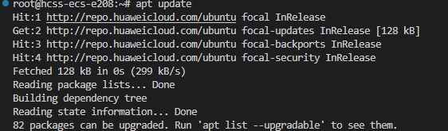

安装常用的构建工具和编译器，例如 `build-essential` 包，其中包括 `gcc`、`g++` 和其他一些开发工具：

```bash
sudo apt install build-essential
```


安装完成后，可以验证 `g++` 编译器是否安装成功：

```bash
g++ --version
g++ (Ubuntu 10.3.0-1ubuntu1~20.04) 10.3.0
```

如果你需要调试工具，可以安装 `gdb`：

```bash
sudo apt install gdb
```

安装代码编辑器（可选）

根据你的偏好，你可以安装各种代码编辑器，例如 `vim`、`emacs`、`VS Code` 等：

```bash
sudo apt install vim
sudo apt install vim
```

**Visual Studio Code**：

1. 下载并安装 Microsoft 的 GPG 密钥和存储库：

   ```bash
   sudo apt update
   sudo apt install software-properties-common apt-transport-https wget
   wget -q https://packages.microsoft.com/keys/microsoft.asc -O- | sudo apt-key add -
   sudo add-apt-repository "deb [arch=amd64] https://packages.microsoft.com/repos/vscode stable main"
   ```

2. 安装 VS Code：

   ```bash
   sudo apt update
   sudo apt install code
   ```


补充：Centos7下安装C++开发环境命令

在CentOS 7上安装C++开发环境，可以通过以下步骤实现。主要是安装GNU编译器集合（GCC）及其C++编译器组件（g++）。

### 安装步骤

1. **更新软件包列表**： 首先，更新系统上的软件包列表，以确保安装最新版本的软件包。

   ```
   sudo yum update -y
   ```

   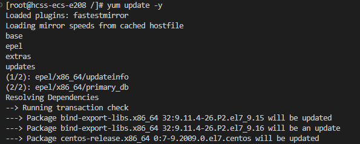

2. **安装GCC和g++**： 使用`yum`包管理器安装GCC和g++。GCC是GNU Compiler Collection的缩写，其中包含C和C++编译器。

   ```
   sudo yum install -y gcc gcc-c++
   ```

3. **验证安装**： 安装完成后，验证是否成功安装并查看GCC和g++的版本。

   ```
   g++ --version
   ```

   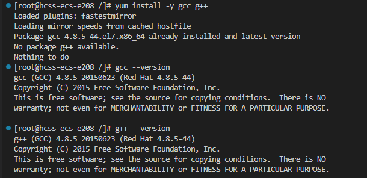

4. **安装开发工具包（可选）**： 如果你需要更多的开发工具，可以安装开发工具包。这将安装一组常用的开发工具，包括调试器和构建工具。

   ```
   sudo yum groupinstall -y "Development Tools"
   ```


### 编写和运行简单的 C++ 程序

你可以使用你喜欢的编辑器创建一个简单的 C++ 程序来测试编译器。例如，创建一个名为 `hello.cpp` 的文件，并写入以下内容：

```C++
#include <iostream>

int main() {
    std::cout << "Hello, World!" << std::endl;
    return 0;
}
```

然后编译并运行该程序：

```
g++ hello.cpp -o hello
./hello
```

你应该会看到输出：

```
Hello, World!
```

通过这些步骤，你应该已经在 Ubuntu 下成功安装并配置了 C++ 开发环境。


如果用vscode远程调试的话，需要下载C++扩展工具和cmake等。

### gem安装速度慢问题

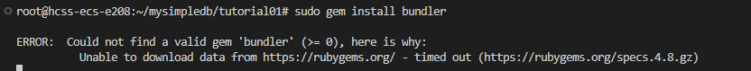

### 解决gem安装慢或卡住

- 使用梯子直接安装。
- 将gem的源改为国内镜像。

替换源是最简单的方法

```
# 替换源
$ gem sources --add https://gems.ruby-china.com/ --remove https://rubygems.org/
# 查看替换后的源地址
$ gem sources -l
https://gems.ruby-china.com
# 确保只有 gems.ruby-china.com

```

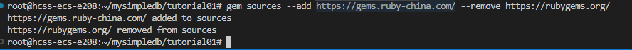


```
gem sources --remove https://rubygems.org/
gem sources -a http://ruby.taobao.org/
gem sources -l

gem sources --add http://ruby.taobao.org/ --remove https://rubygems.org/
```

gem install rspec安装好了 

gem sources --add https://gems.ruby-china.com/ --remove https://rubygems.org/

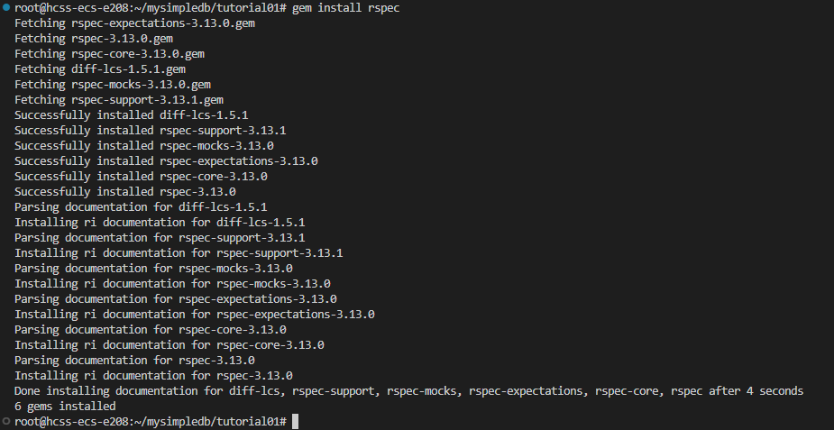